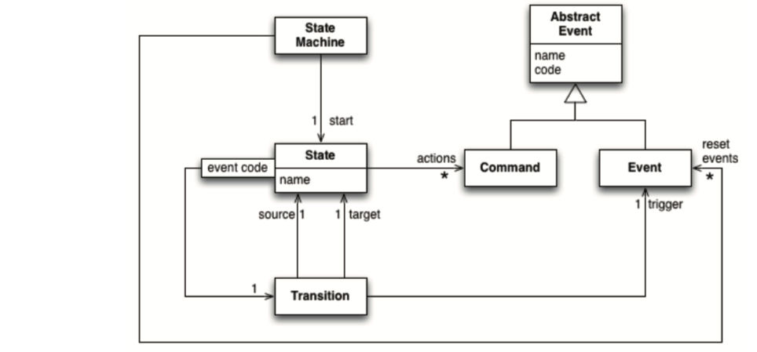
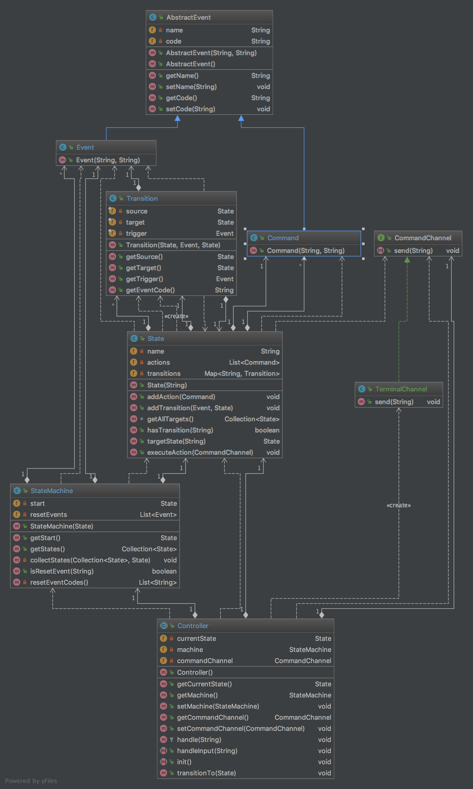
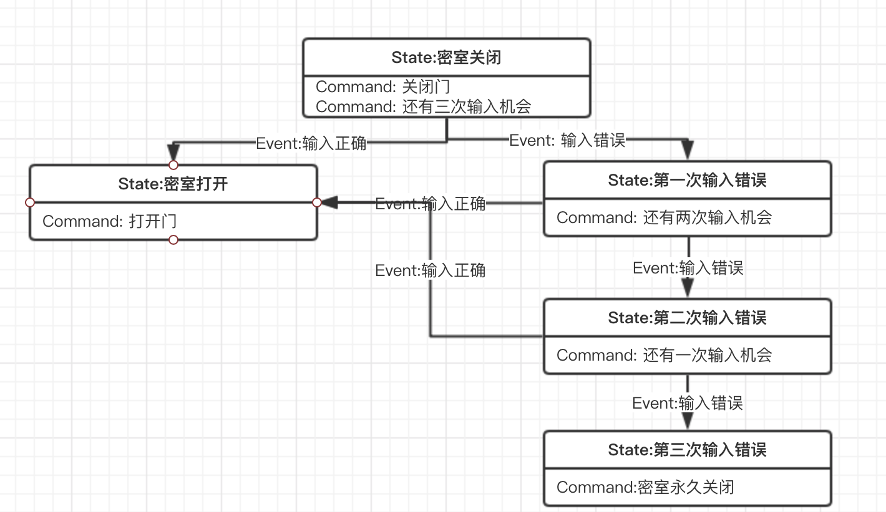

# 密室控制系统

本实验是用 Java 构造了一个有限状态机语言，再用该状态及语言构造一个密室逃脱系 统。
所以代码分为了两个部分:
1. 有限状态机语言
2. 用该语言构造的密室逃脱系统

## 有限状态机语言

上述图选自《领域特定语言》中的第一章，格兰特小姐的密室，这里一个有限状态机模型包 括下列几个部分:

### AbstractEvent

该类是一个抽象事件基类，里面有基本的 C􏰁de 和 Na􏰂e 属性及相应的 􏰈etter，setter 方法 和构造函数。

### Event
事件类，继承自 AbstractEve􏰀t 类，该类指的是触发状态转移的事件，当该类事件触发时， 将导致状态转移

### Command
状态自带的事件类，当状态转移结束后，到达新的类时，被 C􏰁􏰂􏰂a􏰀dC􏰄a􏰀􏰀e􏰅 所调用，用 来执行该状态自带的事件。该类事件不会造成状态的转移

### State
状态类，所有的状态类通过 Eve􏰀t 类可以构造为一个状态图，每个状态包含自带的事件 C􏰁􏰂􏰂a􏰀d，以及事件代码及相应的状态转移类 Tra􏰀s􏰃t􏰃􏰁􏰀 所构造的 Ma􏰇。

### Transition
转移类，Tra􏰀s􏰃t􏰃􏰁􏰀 包含源状态及目标状态，及其相应的触发事件 Eve􏰀t。

除了上述类之外，额外定义了以下几个类:

### CommandChannel
用来执行状态自带的事件类，该类是一个接口，需要具体类继承这个接口来实现相应的处理 函数。做到可扩展，不论在 GUI 环境下还是在控制台下均可通过实现不同的接口来使用。

### TerminalChannel

该类继承自 C􏰁􏰂􏰂a􏰀dC􏰄a􏰀􏰀e􏰅，该类是默认的处理状态自带的事件类，作用是输出 C􏰁􏰂􏰂a􏰀d 的 c􏰁de 到控制台下。

### Controller

该类用来管理 StateMac􏰄􏰃􏰀e，该类在这里实现的是一个抽象类，所以想要使用该有限状态机 语言，必须自己定义一个类继承自该抽象类，实现该类中的抽象方法 􏰃􏰀􏰃t(初始化所有 Eve􏰀t， C􏰁􏰂􏰂a􏰀d，Tra􏰀s􏰃t􏰃􏰁􏰀，State 及 StateMac􏰄􏰃􏰀e)和 􏰄a􏰀d􏰅eI􏰀􏰇ut 方法(处理用户输入)。这样的 目的与 C􏰁􏰂􏰂a􏰀dC􏰄a􏰀􏰀e􏰅 同理，通过不同的 􏰃􏰀􏰃t 实现方式，来实现不同的状态机。通过不 同的 􏰄a􏰀d􏰅eI􏰀􏰇ut 的实现方式，用来将用户输入处理为对应的事件。

## 有限状态机构造的密室逃脱系统

因为实现了上述的有限状态机语言，所以想要构造一个密室逃脱系统只需要下列过程

### 实现 Backroom 类继承自抽象类 Controller

实现抽象类中的 􏰃􏰀􏰃t 方法，初始化所有的 Eve􏰀t，C􏰁􏰂􏰂a􏰀d，State，及相应的 Tra􏰀s􏰃t􏰃􏰁􏰀 以 及他们之间的关心，这样就构造了一个状态机。
实现抽象类中的 􏰄a􏰀d􏰅eI􏰀􏰇ut 的方法，通过接受用户输入，判断是否是学号，使用抽象类中 自带的 􏰄a􏰀d􏰅e 方法来传递事件，控制状态转移。这里只有两个事件，通过判断用户输入的 是否是学号来选择传递正确事件(“RIGHT”)或者是错误事件(“ERROR”)。

### 实现 OutputChannel

该类是用来执行状态自带的 C􏰁􏰂􏰂a􏰀d 方法，每当到达新状态时，调用该状态自带的 C􏰁􏰂􏰂a􏰀d 事件，这里输出到控制台起到提示警告用户的作用。
实现 Main 函数
构造一个 Bac􏰆r􏰁􏰁􏰂 类的对象，使用 W􏰄􏰃􏰅e 循环循环接受用户输入。调用 Bac􏰆r􏰁􏰁􏰂 实现的 抽象类中的 􏰄a􏰀d􏰅eI􏰀􏰇ut 方法处理输入的字符串。

# 元模型

# 密室控制状态图

